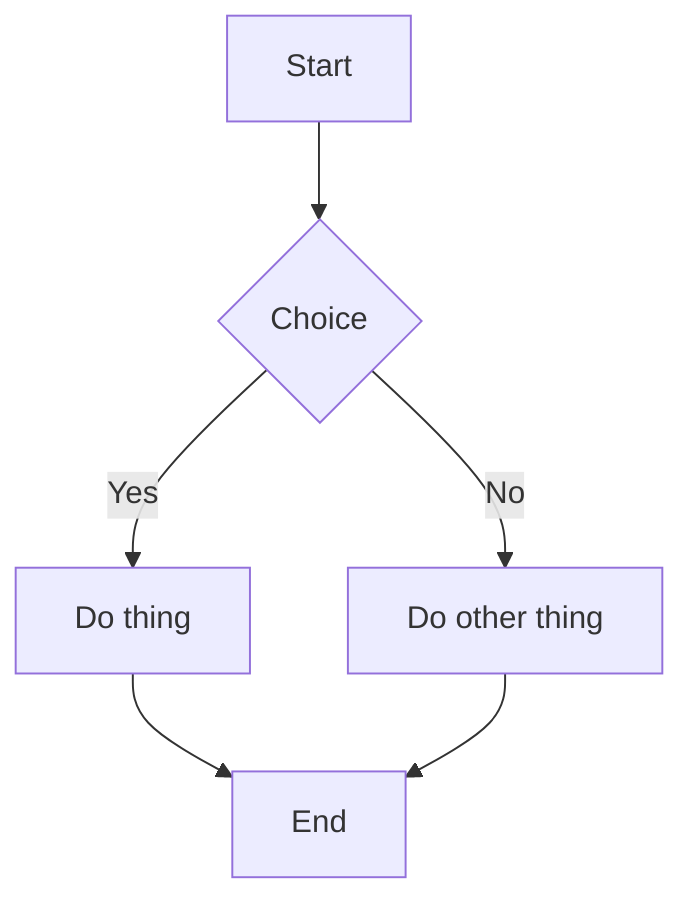
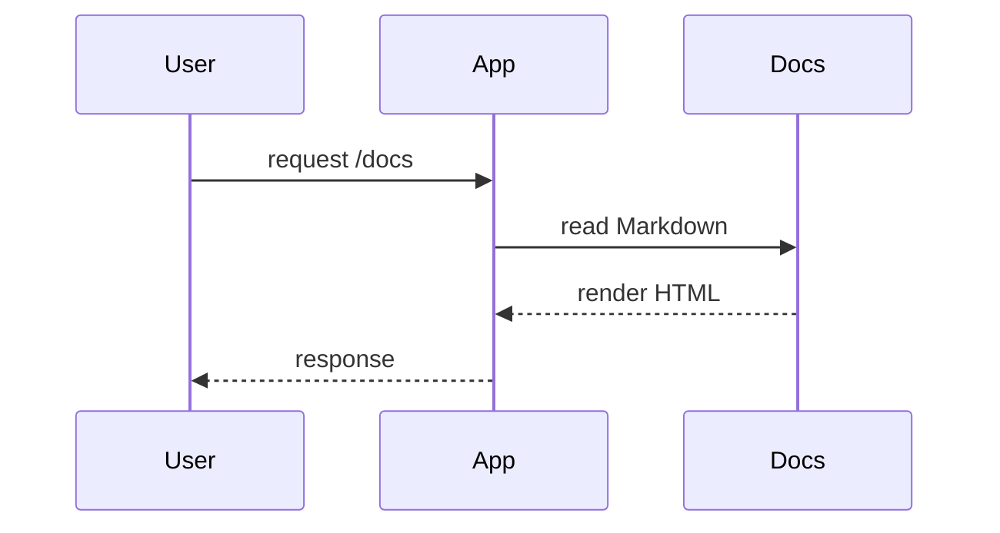
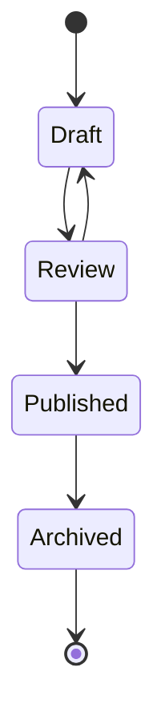

## Mermaid Diagrams (Playground)

Wenn dein Renderer Mermaid unterstützt, sollten diese Diagramme gerendert werden.
Wenn nicht, sollten sie zumindest als Codeblock sichtbar sein.

## Flowchart

## Sequence diagram

## State diagram

